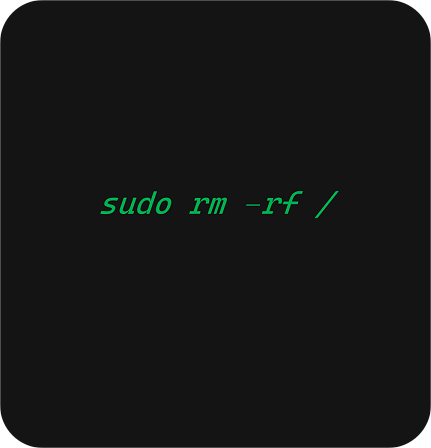
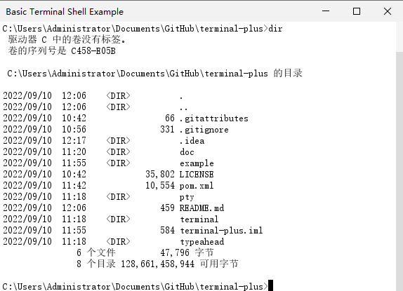

<h1>terminal-plus</h1>

#### 简介

> https://github.com/JetBrains/jediterm

基于 `jediterm` 的 `terminal` 改进项目。

#### 计划

- [ ] 支持终端配色方案
- [x] 修复中文乱码问题，`DefaultSettingsProvider` 配置字体不支持中文导致
- [x] 去除滚动条的重绘，避免覆盖 `FlatLaf` 主题样式

#### 截图

